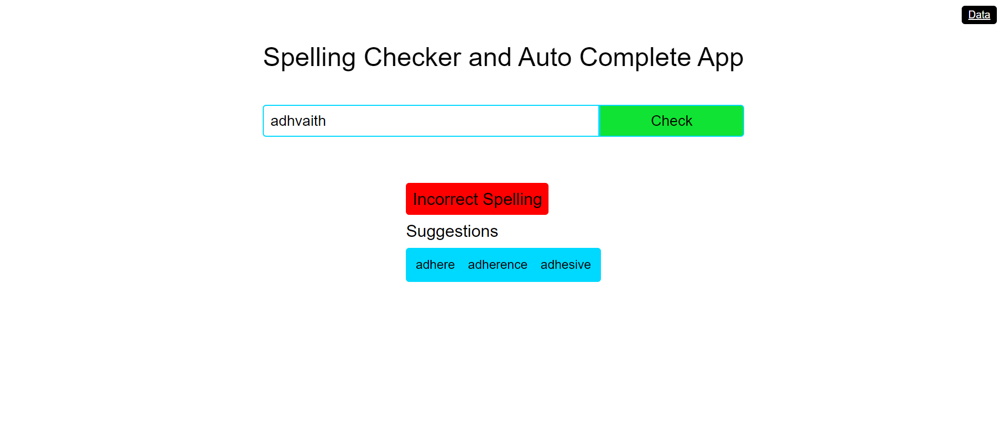
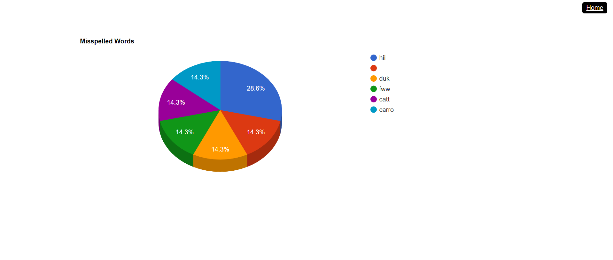

# Spelling Checker and Auto-Complete Project

## Overview

This project is a web-based application that checks the spelling of words and provides auto-complete suggestions using a Trie data structure. The backend is built using Flask, and the frontend is built using React.

## Features

- **Spelling Check**: Verify if a given word is correctly spelled.
- **Auto-Complete Suggestions**: Provide suggestions for misspelled words.
- **History Tracking**: Track and display the most frequently misspelled words.
- **Interactive UI**: User-friendly interface for checking spelling and viewing suggestions.

## Backend

The backend is built using Flask and provides APIs for checking spelling and retrieving suggestions. It also tracks the frequency of misspelled words in a SQLite database.

### Code Logic

- **Trie Data Structure**: A Trie is used to store the dictionary words. Each node of the Trie represents a character of the word. The Trie supports insertion of words and searching for words.
    - **Insertion**: Words are inserted into the Trie character by character.
    - **Search**: To check if a word is correctly spelled, the word is searched in the Trie.
    - **Suggestions**: If the word is not found, the Trie provides auto-complete suggestions by performing a depth-first search (DFS) from the current node.
- **Hash Function**: A custom hash function is used to hash words for quick lookup and storing suggestions in a table to avoid recomputation.

### Flask API

- **Endpoints**:
    - `GET /`: Home route, returns a welcome message.
    - `POST /check`: Check if a word is spelled correctly and get suggestions if it's not.
    - `GET /history`: Get the history of misspelled words and their counts.
- **Database**: A SQLite database is used to store and track the frequency of misspelled words.

## Frontend

The frontend is built using React and provides a user interface for interacting with the spelling checker.

### Code Logic

- **Home Component**: Main component for checking spelling and displaying suggestions.
    - **Input Field**: Allows users to enter a word for spelling check.
    - **Check Button**: Sends the input word to the backend for validation.
    - **Results**: Displays whether the word is correctly spelled and provides suggestions if it is not.
- **Data Component**: Component for displaying the history of misspelled words in a pie chart using the Google Charts library.

